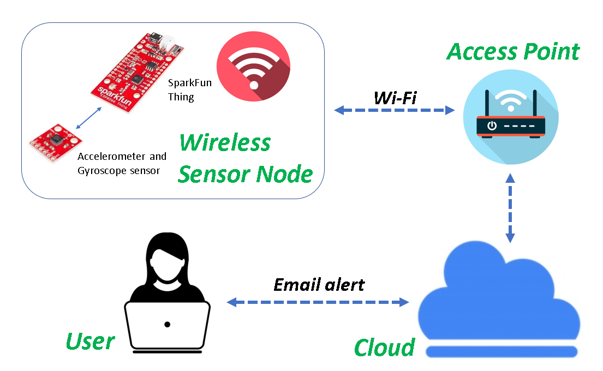
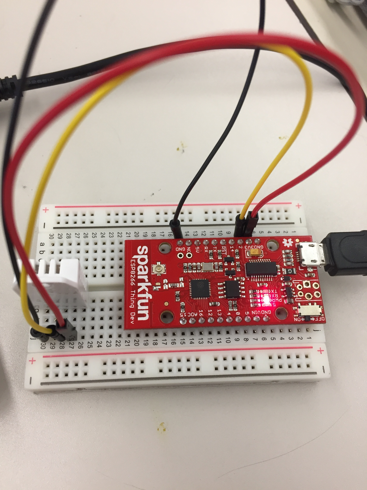
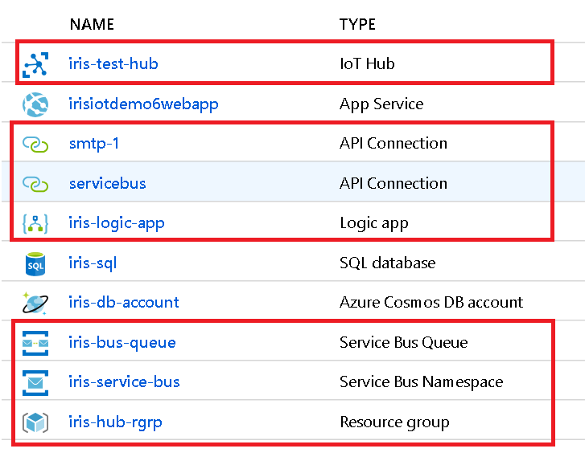
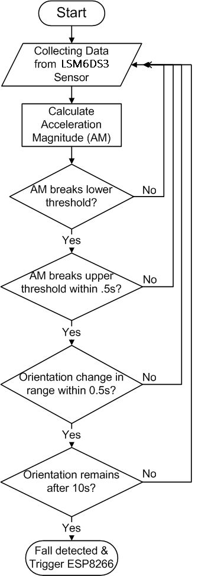
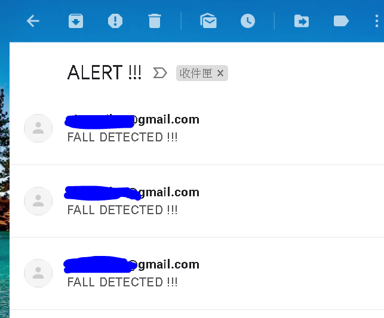

# Fall Detection with Email Alert

Our device is inspired by and designed for elders who use walking canes for mobility assistance. To ensure the safety of the elders, we implemented fall detection in our device to sense any falling movements of the elderly people and trigger email alerts to notify their carers when the falling accident happens. Our device utilizes the SparkFun Thing development board and accelerometer/gyroscope sensor to detect movements and continuously send movement data to the Azure IoT hub for data collection. For the purpose of remote monitoring and instant email notifications, we connect our IoT hub and mailbox with the help of Azure Logic Apps. The Azure Logic Apps provides a way to connect across various services and protocols, which makes it a decent IoT solution for monitoring. 

A brief architecture diagram is shown below to demonstrate our idea for fall detection device:

## Components

The following components are used in this project:

| Components                        | Category      | Usage                                  |
| :---------------------------------|:-------------:|----------------------------------------|
| SparkFun ESP8266 Thing Dev Board  | Hardware      | Development board with Wi-Fi module |
| SparkFun LSM6DS3 Sensor           | Hardware      | Accelerometer and gyroscope sensor|
| Azure IoT Hub                     | Software      | IoT device management|
| Azure Logic Apps                  | Software      | Connection between IoT hub and mailbox for monitoring and notification|
| Azure Service Bus                 | Software      | Cloud messaging|

## Wiring Setup

Wiring for SparkFun ESP8266 Thing Dev Board and SparkFun LSM6DS3 Sensor:

* SDA -> 4
* SCL -> 5
* GND -> GND
* 3.3V -> 3.3V

## Services Used

Services used in Azure cloud platform (see the ones circled in red):

## Fall-Detection Algorithm
We used the fall-detection algorithm from [here](https://www.instructables.com/id/Emergency-Fall-Notifier-Cum-Panic-Button/). The algorithm is developed based on the transitions of the falling movement. When a person falls, he/she first senses 

1. a temporary moment of freefall, followed by 
2. increasing acceleration, then eventually 
3. a change in orientation. 

The algorithm calculates the acceleration magnitude (AM) based off the collected data from sensor and checks if the AM breaks a lower threshold (corresponding to (1)). If the lower threshold is broken, we proceed further to see if an upper threshold (corresponding to <2>) is broken. If the upper threshold is broken, we continue to examine if there’s any change in the person’s orientation (corresponding to <3>) within short time. If the person’s orientation has changed and remains the same after some time, the algorithm recognizes this as a fall. 

Below is a flow chart of the algorithm:

## Result

When falling movement is detected by our device, email alert is sent for notification. 

## Contributors
* **Kuo-Wei Chiao**
* **[Pin-Ying Wu](https://github.com/pinyingiriswu/)**

## Acknowledgments & References

* [Internet of Things Experiment Guide](https://learn.sparkfun.com/tutorials/internet-of-things-experiment-guide/experiment-1-temperature-and-humidity-logging)

* [ESP8266 Thing Hookup Guide](https://learn.sparkfun.com/tutorials/esp8266-thing-hookup-guide/hardware-overview)

* [Email security](https://myaccount.google.com/u/2/security?pageId=none)

* [Fall detection 1](https://www.hackster.io/gatoninja236/esp8266-fall-detector-and-alerter-7acac9)

* [Fall Detection 2](https://www.instructables.com/id/Emergency-Fall-Notifier-Cum-Panic-Button/)

* [Azure IoT Hub configuration](https://docs.microsoft.com/en-us/azure/iot-hub/iot-hub-arduino-huzzah-esp8266-get-started)

* [Azure IoT hub to mailbox](https://docs.microsoft.com/en-us/azure/iot-hub/iot-hub-monitoring-notifications-with-azure-logic-apps?fbclid=IwAR2qzJvpQ4Kmm8Sn9U1v8we5xi1KyAtlPKtcFKOdS3Bzk1hkIMqvtViXs50)
