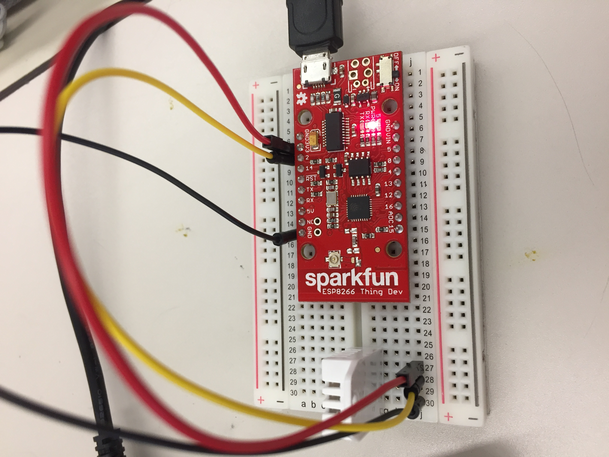

# Project Title

One Paragraph of project description goes here

## Getting Started

These instructions will get you a copy of the project up and running on your local machine for development and testing purposes. See deployment for notes on how to deploy the project on a live system.

### Prerequisites

What things you need to install the software and how to install them

```
Give examples
```

### Wiring

* SDA -> 4
* SCL -> 5
* GND -> GND
* 3.3V -> 3.3V



### Installing

A step by step series of examples that tell you how to get a development env running

Say what the step will be

```
Give the example
```

And repeat

```
until finished
```

End with an example of getting some data out of the system or using it for a little demo

## Running the tests

Explain how to run the automated tests for this system

### Break down into end to end tests

Explain what these tests test and why

```
Give an example
```

### And coding style tests

Explain what these tests test and why

```
Give an example
```

## Deployment

Add additional notes about how to deploy this on a live system

## Built With

* [Dropwizard](http://www.dropwizard.io/1.0.2/docs/) - The web framework used
* [Maven](https://maven.apache.org/) - Dependency Management
* [ROME](https://rometools.github.io/rome/) - Used to generate RSS Feeds


## Contributors
* **Kuo-Wei Chiao**
* **[Iris Wu](https://github.com/pinyingiriswu/)**


## Acknowledgments & References

* [Temperature sensor hookup](https://learn.sparkfun.com/tutorials/internet-of-things-experiment-guide/experiment-1-temperature-and-humidity-logging)

* [ESP8266 hookup](https://learn.sparkfun.com/tutorials/esp8266-thing-hookup-guide/hardware-overview)

* [Email security (Allow less secure apps: ON)](https://myaccount.google.com/u/2/security?pageId=none)

* [Fall detection](https://www.hackster.io/gatoninja236/esp8266-fall-detector-and-alerter-7acac9)

* [Azure IoT Hub configuration](https://docs.microsoft.com/en-us/azure/iot-hub/iot-hub-arduino-huzzah-esp8266-get-started)

* [Azure IoT hub to mailbox](https://docs.microsoft.com/en-us/azure/iot-hub/iot-hub-monitoring-notifications-with-azure-logic-apps?fbclid=IwAR2qzJvpQ4Kmm8Sn9U1v8we5xi1KyAtlPKtcFKOdS3Bzk1hkIMqvtViXs50)